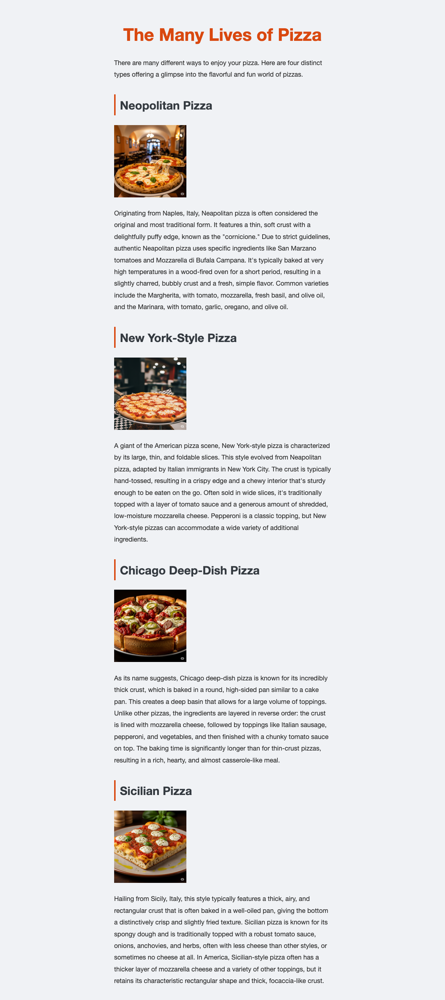

# pizza-page

CISB 11 starter materials for the Pizza Page classroom demo.

Use this repo to build a plain HTML page, add pizza content and images, connect a CSS stylesheet, and then use AI to experiment with different visual styles.

## Start Here

- [Pizza Page Instructions](instructions.md)
- [Pizza Information](pizza-information.md)

## Included Images

- `neopolitan.png`
- `newyork.png`
- `chicago.png`
- `sicilian.png`
- `example.png`

Your page might look like this when you are finished:

